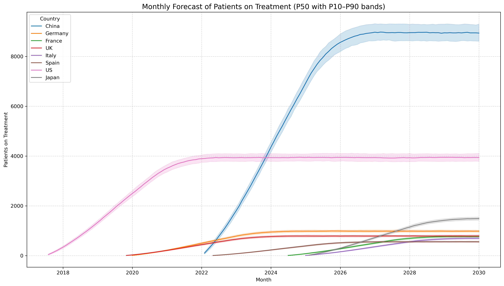

# 🧪 Single- and Multi-Market Simulation Based Forecast for Drug X

This repository provides a modular and vectorized simulation framework for forecasting patient uptake of a new drug (Drug X) across multiple countries. The goal is to support strategic planning with an uncertainty-aware model of market dynamics and treatment persistence.

---

## 📚 Notebooks Overview

| Notebook | Description |
|----------|-------------|
| **01_Forecast_Patient_Uptake_for_DrugX** | Builds a basic stichastic forecast for a single market. |
| **02_Simulation_Based_Forecast** | Extends the logic to generate a funnel of possible forecasts for a single market by running several simulations. |
| **03_Simulation_Based_Forecast_Multi_Markets** | Runs simulation-based forecasts for Drug X adoption and persistence across multiple countries.. |
| **04_Vectorized_Forecast_Patient_Uptake_for_DrugX** | Refactors simulation logic using NumPy vectorization to support faster execution and scalability across simulations. |
| **05_Vectorized_Simulation_Based_Forecast_Multi_Markets** | Implements a vectorized simulation framework to model patient uptake of Drug X across multiple countries and simulation runs. |

---

## 🧬 Simulation Logic Overview
Below is a diagram showing how the simulation steps are chained:

All simulation functions are reusable, modular, well-documented, and stored in `utils.py` and `utils_vect.py`

---

## 🎯 Applications

This framework enables:
- **Market sizing and prioritization**
- **Scenario analysis under uncertainty**

With a solid patient-level forecast, future extensions could integrate cost structures, pricing scenarios, or logistics planning.

---

## 🤖 Technology Used
- NumPy
- Pandas
- Matplotlib
- This project was developed with the support of **ChatGPT**, used extensively for designing simulation logic, vectorization strategies, visualization techniques, and documentation structure.

--- 
## 📊 Example Output
Here are some visual outputs generated by the simulation framework.

**5 simulations of persistence on Drug X over time:**

**Median Patient Forecast with Uncertainty Bands per Country:**
This plot shows forecasted monthly patients on treatment by country, including the 10th–90th percentile uncertainty band.

